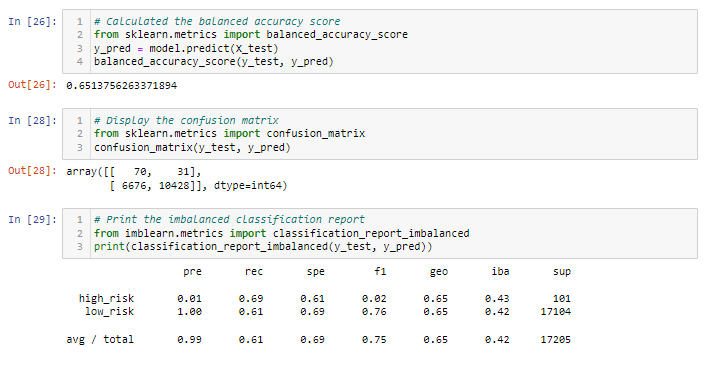
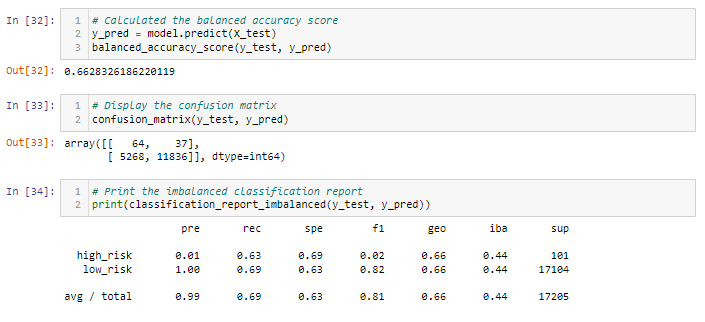
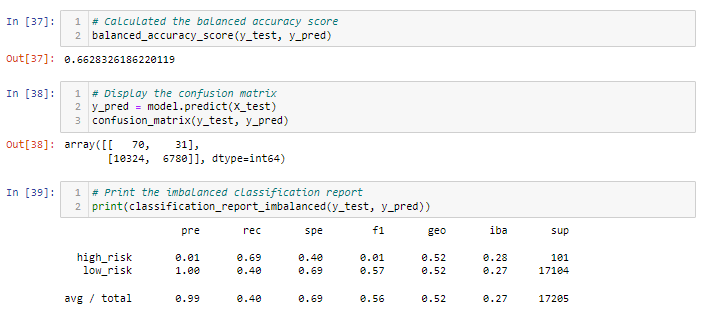
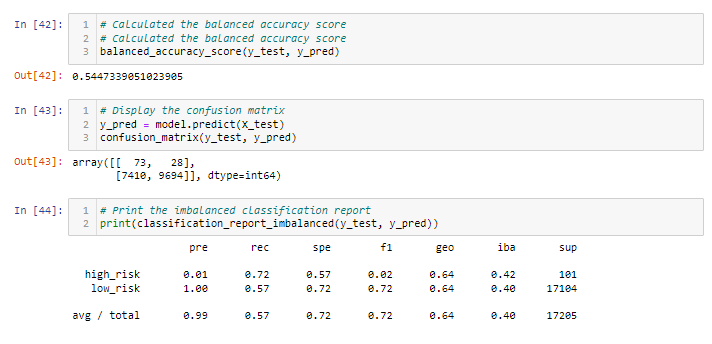
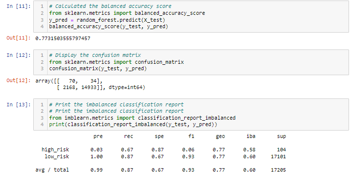
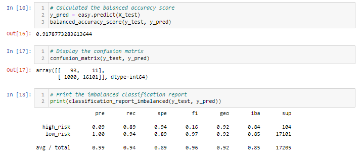

# Credit_Risk_Analysis

## Overview

- Credit risk is a very complex area of the financial industry today, but with supervised machine learning, we can help to better predict if an applicant belongs in a high or low risk bucket based on a handful of application factors.  For this specific project, we utilize imbalanced-learn and scikit-learn library methods to evaluate our data using resampling.  We first oversample the data using the randomoversampler component as well as SMOTE, then undersample the data with the clustercentroid component.  From there, we combine both over and undersampling using SMOTEENN.  Finally, we utilize the following learning models, balancedrandomforestclassifier and easyensembleclassifier, to help minimize data bias further.

## Results

### Naive Random Oversampling

- Our balanced accuracy test is at 65.1%, the precision for the high_risk has a very low positivity at 1% and the recall for high_risk is 69%.

### SMOTE Oversampling

- The results show that the accuracy score is 66.2%, the precision for the high_risk loans has a low positvity again at 1% and recall is 69% overall.

### Undersampling

- The balanced accuracy score is 66.3% overall, the precision is at 99% and the recall is 40%.

### Combination (Over and Undersampling)

- The balanced accuracy score is 54.5%, the precision is 99% and the recall is 57%.

### Balanced Random Forest Classifier

- The accuracy score is 77.3%, the precision is 99% and the recall is 87%.

### Easy Ensemble AdaBoost Classifier

- The accuracy score is 91.7%, the precision is 99% and the recall is 94%.

## Summary

- The first four models consisted of undersampling, oversampling and then a combination of both to try determining which model would be the best to use in practice at predicting which loan applicants are the highest risk.  After that, data was agan resampled but instead using ensemble classifiers for predicting high and low risk loan applicants.  For the first four models we performed, the accuracy score was not as high as we'd ideally like to see, ranging anywhere from 54% to 66%.  On the flip side, the balanced random forest and ensemble classifiers had much higher accuracy, at 77.3% and 91.7% accurate, respectively.  On top of that, another key factor is to ensure the recall and precision scores are also at a high confidence level, thus why the Easy Ensemble AdaBoost Classifier seems to be the best model to utilize for determining loan applicant risk, as it has the highest accuracy score at 91.7%.  The precision are recall are also very high, at 99% and 94% respectively as well, which further complements why this model is the best one to move forward with utilizing.  